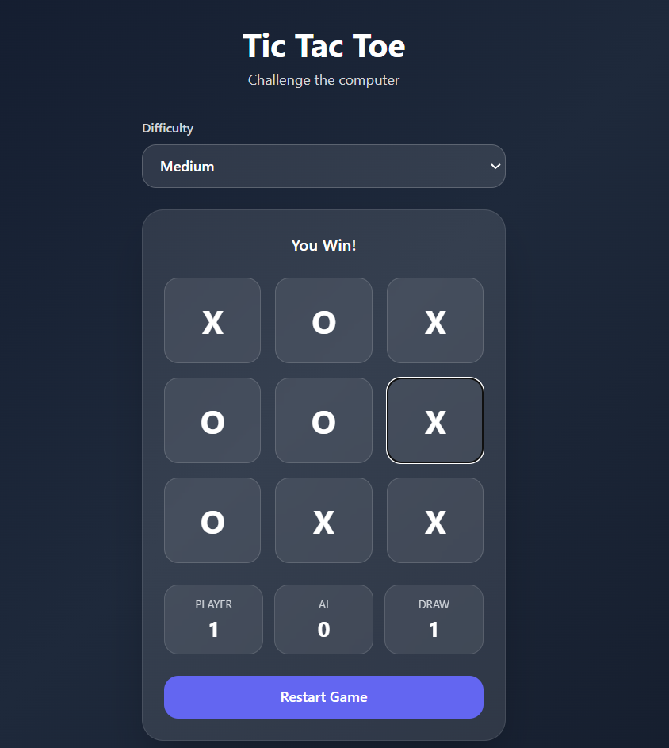

# Tic Tac Toe AI

An AI-powered Tic Tac Toe web application built with **Django**, **JavaScript**, and **Tailwind CSS**, featuring intelligent gameplay using the **Minimax Algorithm**.

## Live Demo
https://tic-tac-toe-zz6j.onrender.com

##  Features
- Play against AI
- Easy / Medium / Hard difficulty
- Smart AI using Minimax
- Live score tracking (Player / AI / Draw)
- Responsive modern UI
- Smooth AI thinking delay
- Deployed on Render

## Tech Stack
- Python
- Django
- JavaScript
- HTML
- Tailwind CSS

## AI Logic
The AI uses the **Minimax Algorithm** to evaluate moves and choose the best possible action in Hard mode.

- **Easy:** Random moves  
- **Medium:** 60% smart move + 40% random move  
- **Hard:** Best move using Minimax  

##  Preview


##  Run Locally

```bash
git clone YOUR_REPO_LINK
cd tic-tac-ai
pip install -r requirements.txt
python manage.py runserver
```

Open:

```text
http://127.0.0.1:8000/
```

## Future Plans
- Add 8 Puzzle game
- User authentication
- Match history
- Expand into an AI game platform
